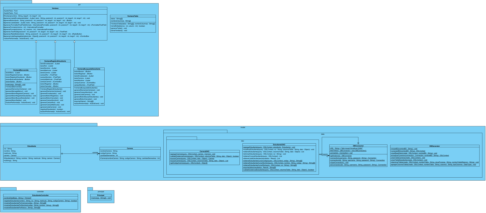

## INTRANET 2.0
### Descripción del Proyecto
Este proyecto tiene como objetivo desarrollar una aplicación de gestión estudiantil usando Programación Orientada a Objetos (POO) e interfaces gráficas para la intranet de la Universidad de La Frontera (UFRO). El sistema permite registrar y gestionar estudiantes y carreras, proporcionando funcionalidades para agregar, eliminar y buscar estudiantes dentro de diversas carreras.

### Estructura del Sistema
#### Paquetes y Clases
El sistema está organizado en varios paquetes que facilitan la modularidad y el mantenimiento del código:

* model: Contiene las clases Carrera y Estudiante. Incluye subpaquetes:
  * data: Incluye clases para la conexión (DBConnector) y creación (DBGenerator) de la base de datos.
  * dao: Incluye CarreraDAO y EstudianteDAO para gestionar operaciones CRUD sobre la base de datos.
* controller:
  * CarreraController: Gestiona la lógica de negocio relacionada con las carreras.
  * EstudianteController: Gestiona la lógica de negocio relacionada con los estudiantes.
* gui/vista:
  * Ventana: Clase base para las ventanas.
  * VentanaBienvenida: Ventana inicial que muestra las opciones principales.
  * VentanaBusquedaEstudiante: Permite la búsqueda de estudiantes por nombre y/o carrera.
  * VentanaRegistroCarrera: Permite el registro de nuevas carreras.
  * VentanaRegistroEstudiante: Permite el registro de nuevos estudiantes.
  * VentanaTabla: Utilizada para mostrar los resultados de las búsquedas.
* principal:
  Clase principal que inicializa el proyecto.
#### Funcionalidades
*   Registrar Carrera: Permite ingresar una nueva carrera verificando que no exista previamente.
*   Registrar Estudiantes: Permite añadir estudiantes a una carrera existente, validando la existencia previa de la carrera.
*   Buscar Estudiantes: Búsqueda por nombre y/o carrera, con validaciones para asegurar que los campos necesarios estén completos.
*   Gestión de Carreras: Incluye agregar y eliminar carreras, con validaciones para evitar inconsistencias.
*   Gestión de Estudiantes: Incluye agregar y eliminar estudiantes de carreras específicas.

#### Diagrama de Clases UML
